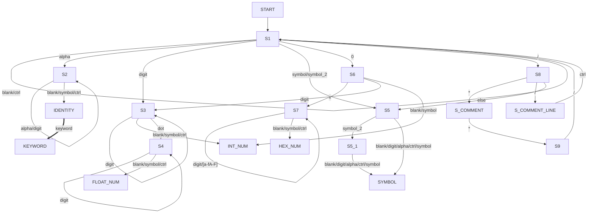

# FSM of lexer

```mermaid
graph TD
    START-->S1

    S1--blank/ctrl-->S1
    S1--alpha-->S2
    S1--digit-->S3
    S1--symbol/symbol_2-->S5
    S1--0-->S6
    S1--/-->S8

    S2--alpha/digit-->S2
    S2--blank/symbol/ctrl-->IDENTITY
    IDENTITY==keyword==>KEYWORD

    S3--digit-->S3
    S3--blank/symbol/ctrl-->INT_NUM
    S3--dot-->S4
    S4--digit-->S4
    S4--blank/symbol/ctrl-->FLOAT_NUM

    S5--symbol_2-->S5_1
    S5--blank/digit/alpha/ctrl/symbol-->SYMBOL
    S5_1--blank/digit/alpha/ctrl/symbol-->SYMBOL

    S6--"x"-->S7
    S6--digit-->S3
    S6--blank/symbol-->INT_NUM
    S7--"digit/[a-fA-F]"-->S7
    S7--blank/symbol/ctrl-->HEX_NUM

    S8--*-->S_COMMENT
    S8--/-->S_COMMENT_LINE
    S8--else-->S5

    S_COMMENT--*-->S9

    S9--/-->S1

    S_COMMENT_LINE--ctrl-->S1
```