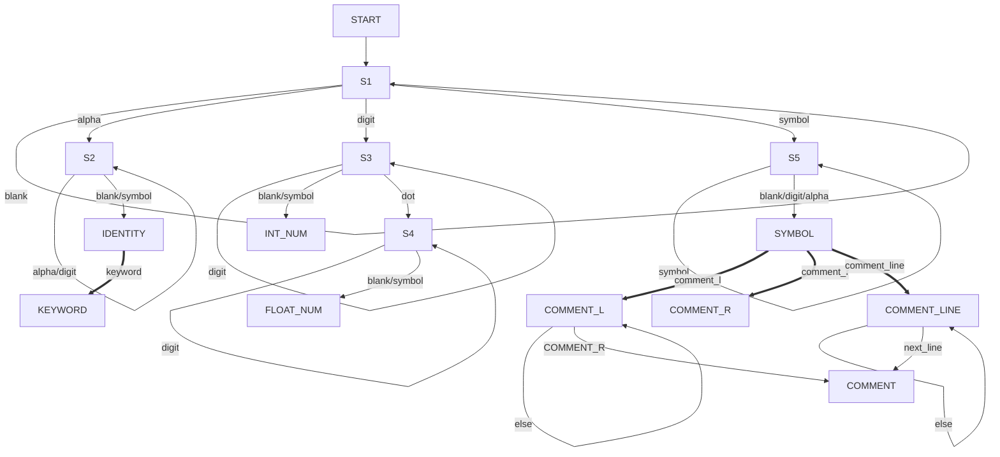

# FSM of lexer

```mermaid
graph TD
    START-->S1

    S1--blank-->S1
    S1--alpha-->S2
    S1--digit-->S3
    S1--symbol-->S5

    S2--alpha/digit-->S2
    S2--blank/symbol-->IDENTITY
    IDENTITY==keyword==>KEYWORD

    S3--digit-->S3
    S3--blank/symbol-->INT_NUM
    S3--dot-->S4
    S4--digit-->S4
    S4--blank/symbol-->FLOAT_NUM

    S5--symbol-->S5
    S5--blank/digit/alpha-->SYMBOL
    SYMBOL==comment_l==>COMMENT_L
    COMMENT_L--else-->COMMENT_L
    COMMENT_L--COMMENT_R-->COMMENT
    SYMBOL==comment_r==>COMMENT_R
    SYMBOL==comment_line==>COMMENT_LINE
    COMMENT_LINE--else-->COMMENT_LINE
    COMMENT_LINE--next_line-->COMMENT
```